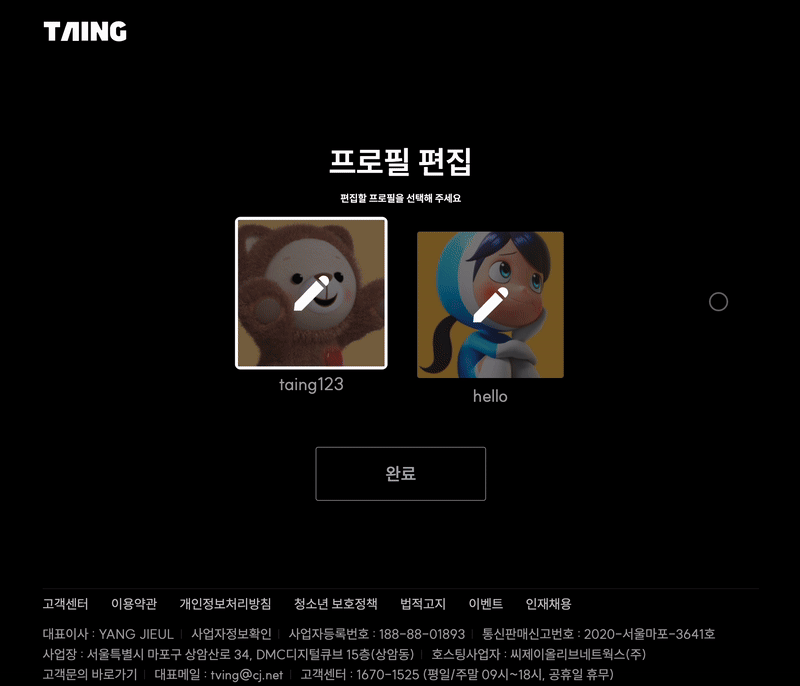

# TVING Clone: 팀 프로젝트 & 개인 리팩토링 with Vanilla JavaScript


<div align="center">
<strong>✨ 배포 URL ✨</strong>

https://techit-taing.netlify.app/

<strong>✨ Test ID ✨</strong>

_**taing777**_

<strong>✨ Test PW ✨</strong>

_**taing777!**_

</div>

<br>

## 🔍 프로젝트 소개

### 🌱 개요

- 국내 OTT 사이트 '티빙(TVING)'을 클론 코딩하고, 이후 **전반적인 리팩토링을 진행한 프로젝트**입니다.

### 🎯 목표

- HTML, SCSS, JavaScript를 활용하여 실제 서비스되고 있는 TVING 웹사이트를 클론코딩하며 프론트엔드 기본기를 다집니다.
- Pocketbase를 활용한 데이터베이스 연동으로 기본적인 CRUD 작업을 학습합니다.
- Git을 통한 버전 관리와 GitHub을 활용한 협업을 경험하며, 팀 프로젝트 수행 능력을 향상시킵니다.
- 바닐라 자바스크립트만으로 웹 애플리케이션을 구현하여 JavaScript의 동작 원리와 웹 개발의 기초를 이해합니다.

<br>

## 👥 팀원

- [김지윤(스크럼 마스터)](https://github.com/Yooniverse42)
- [곽승헌](https://github.com/nada77777)
- [김승수](https://github.com/seungsu-K)
- [최다경](https://github.com/daggi-01)

<br>

## 🛠 기술 스택

| 분류                            | 기술                                                                                                                                                                                                                                                                                                                                                                                                                                                                                    |
| :------------------------------ | :-------------------------------------------------------------------------------------------------------------------------------------------------------------------------------------------------------------------------------------------------------------------------------------------------------------------------------------------------------------------------------------------------------------------------------------------------------------------------------------- |
| Development                     |                                                                                                                                                                                                                                                                                        |
| Styling                         |                                                                                                                                                                                                                                                                                                                                                                                                   |
| Libraries & Frameworks          |                                                                                                                                                                                                                                                                                                  |
| Design                          |                                                                                                                                                                                                                                                                                                                                                                                                |
| Environment                     |      |
| Database & Deploy               |                                                                                                                                                                                                                                                                                  |
| Version Control & Collaboration |                                                                                                               |

<br>

## 💡 주요 기능

### ♿ 접근성 고려사항

- 키보드 접근성

  - 모든 상호작용 요소에 대한 키보드 접근 및 조작 가능
  - 논리적인 포커스 이동 순서

- 스크린리더 지원

  - WAI-ARIA 적절히 적용
  - 의미 있는 대체 텍스트 제공
  - 명확한 랜드마크와 헤딩 구조

- 시맨틱 마크업

  - HTML5 시맨틱 태그 활용 (header, nav, main, footer 등)
  - 콘텐츠의 논리적 구조 명확히 표현
  - 의미에 맞는 적절한 태그 사용

- 가독성

  - 텍스트와 배경 간 충분한 명도 대비 확보
  - 브랜드 색상 밝기 조정으로 가독성 향상
  - 텍스트 크기와 행간 최적화

### 🚀 성능 최적화

- 이미지 최적화

  - WebP 포맷 사용으로 이미지 용량 감소
  - 반응형 디자인에 따른 최적화된 이미지 제공
  - CSS 스프라이트 기법을 통한 아이콘 최적화

---

### 1. 공통 컴포넌트

### 1-1. Header

#### 기본 헤더 (랜딩•로그인•회원가입•프로필 페이지)


#### 메인 헤더(메인•검색 페이지)


- 로고 동작 : 랜딩 페이지로 이동

<br>

| 🕹️ 개선사항 |
| :---------- |

- 로고 동작
  - 비로그인 상태: 랜딩 페이지로 이동
  - 로그인 상태: 프로필 선택 페이지로 이동
  - 프로필 선택 완료 상태: 메인 페이지로 이동
- 메인 헤더는 메인 페이지에서만 나오도록 개선
- 각 프로필 이미지가 출력되도록 구현

<br>

### 1-2. Footer


- 명확한 섹션 구분 및 관련 사이트로 이동 가능

<br>

| 🕹️ 개선사항 |
| :---------- |

- 가독성을 위해 텍스트의 명도 대비율 및 행간 수정
- 외부 링크로써 새 탭으로 오픈되며, rel="noopener noreferrer" 적용으로 보안 강화

<br>

---

### 2. 랜딩 페이지


- 버튼 클릭 시 로그인 페이지로 이동
- 스와이퍼를 이용하여 여러 콘텐츠 확인 가능

<br>

| 🕹️ 개선사항 |
| :---------- |

- 버튼 동작 최적화 (스크린리더 사용자도 어떤 동작인지 알 수 있도록 WAI-ARIA 추가)
  - 비로그인 상태: 로그인 페이지로 이동
  - 로그인 상태: 프로필 선택 페이지로 이동
  - 프로필 선택 완료 상태: 메인 페이지로 이동
- 디바이스 크기에 따른 슬라이더(swiper) 크기 최적화
- GSAP을 활용하여 애니메이션 적용

<br>

---

### 3. 로그인 페이지


<div align="center">
   
</div>

- 유효성 검사 및 에러 메시지 표시
- 폼 유효성 실시간 검증
- 비밀번호 표시/숨김 토글
- DB 유저 정보 대조
- 로그인 성공/실패 알림

<br>

| 🕹️ 개선사항 |
| :---------- |

- Enter 키로 로그인 기능 추가
- 비밀번호 토글 버튼을 checkbox로 변경 및 WAI-ARIA 적용으로 스크린리더 지원 강화
- 로딩 스피너를 이용하여 UX 향상

<br>

---

### 4. 회원가입 페이지


- 유효한 이메일 및 비밀번호, 이메일 형식 검증(형식에 맞지 않으면 에러 메시지 표시)
- 비밀번호 일치 검사
- 위 항목 충족 및 이용 필수 약관 동의 체크 시 가입하기 버튼 활성화
- 회원가입 버튼 클릭 시 DB에 유저 생성
- 가입 진행 중 로딩 스피너 표시
- 중복 이메일 체크 및 알림
- 랜덤으로 기본 프로필 이미지 생성

<br>

| 🕹️ 개선사항 |
| :---------- |

- 회원가입 완료 알림 추가
- 계정별 개별 프로필 관리 기능 구현

<br>

---

### 5. 아이디/비번 찾기 페이지


<div align="center">
   
</div>

- 가입 여부 확인
- 이메일/본인인증으로 유저 정보 검증
- 아이디 정보 알림창 표시
- 가입 이메일로 비밀번호 발송

---

### 6. 프로필

### 6-1. 프로필 선택 / 편집


- 프로필 선택 → 메인 페이지 이동
- 프로필 편집 버튼 선택 → 프로필 편집 페이지 이동

| 🕹️ 개선사항 |
| :---------- |

- 공통

  - 로그인 후 프로필이 다 불러올 때까지 로딩 스피너 띄움으로써 UX 개선
  - DB 재설계를 통한 프로필 관리 시스템 개선, 프로필 관리 시스템 최적화
  - PIN 번호 검증 및 에러 메시지 표시
  - 계정 비밀번호로 잠금 해제/초기화
  - 키보드 접근성 강화
  - 각 프로필에 GSAP 애니메이션을 적용

- 프로필 선택

  - 회원가입 시 하나의 프로필만 생성
  - 프로필 수에 따른 생성 아이콘 표시/숨김
  - 잠금 설정 시 프로필에 잠금 아이콘 추가
  - PIN 번호 검증 후 메인 페이지 이동

- 프로필 편집
  - PIN 번호 검증 후 편집 페이지 접근

<br>

### 6-2. 프로필 추가 / 편집 세부

<div align="center">
   
  <br/>
   
</div>

| 🕹️ 개선사항 |
| :---------- |

- 공통

  - 프로필 잠금 설정/해제 가능, WAI-ARIA로 설정 상태 안내
  - 뒤로가기 버튼 클릭 시 알림창 표시
  - 잠금 설정 토글에 GSAP 애니메이션 적용

- 프로필 추가

  - 최대 4개 프로필 생성 가능
  - 랜덤 프로필 이미지 생성
  - 프로필명 미입력 또는 중복일 경우 에러 알림창 표시

- 편집 세부
  - 프로필명 중복일 경우 에러 알림창 표시
  - 프로필 삭제 기능 구현
  - 마지막 프로필 삭제 방지 및 알림

<br>

---

### 7. 메인 페이지


<div align="center">
   
</div>

- 로딩 스피너를 이용하여 UX 향상
- 메인 배너 및 컨텐츠 Swiper 구현
- Swiper의 prev, next 버튼 및 페이지네이션 구현
- 각 슬라이드 포켓베이스 데이터 연동
- 메인 배너 포함 각 컨텐츠 스와이퍼 구현
- 로그인한 경우에만 페이지 노출되도록 구현

| 🕹️ 개선사항 |
| :---------- |

- 모든 포스터에 키보드 포커스 지원
- 반응형 포스터 크기 조정
- 이벤트 팝업 연동
- 24시간 재표시 방지 기능

### 7-1. 네비게이션 메뉴 세부 페이지


| 🕹️ 개선사항 |
| :---------- |

- 키보드 접근성 지원
- 관련 포스터 동적 렌더링

### 7-2. 검색 기능


- 최근 검색어 저장 및 개별 삭제 가능

| 🕹️ 개선사항 |
| :---------- |

- 프로필 별 최근 검색어 저장 및 검색어 전체/개별 삭제 가능
- 인기 검색어 클릭 시 검색 가능
- 키보드로 모든 목록에 접근 가능하며 ESC키로 모달 닫기 가능
- 실시간 컨텐츠 필터링
- 결과 없을 시 인기 검색어 추천, 검색어 클릭 시 검색 가능

### 7-3. 프로필 다이얼로그

<div align="center">
   
</div>

- 로그아웃 및 회원탈퇴 가능
- 프로필 편집에서 프로필명 변경 가능

| 🕹️ 개선사항 |
| :---------- |

- 반응형 모달 크기
- 프로필 편집에서 잠금 설정 가능
- 프로필 전환 버튼 클릭 시 프로필 선택 페이지로 이동

<br>
<br>
<br>

## 📈 전체적인 프로젝트 개선 과정

### 1. 데스크탑 Breakpoint 최적화

- 피그마 시안의 데스크탑 해상도(1920px)와 실제 사용자 환경의 불일치
- 1280px~1920px 해상도 사용자들의 태블릿 레이아웃 강제 노출

> - 모바일: min-width 320px
> - 태블릿: min-width 768px
> - 데스크탑: min-width 1920px

#### 개선사항

> 데스크탑 해상도 사용 통계 (23.10 ~ 24.10, https://gs.statcounter.com/ 참고)
>
> - 1위: 1920px
> - 2위: 1366px
> - 3위: 1536px
> - 4위: 1280px

- 프로젝트 특성: 90% 이상이 이미지 콘텐츠로 구성
- 이미지 해상도 문제가 사용자 경험을 크게 저해할 것이라 판단

Breakpoint 기준 변경

> - Mobile: min-width 320px
> - Tablet: min-width 768px
> - Desktop: min-width 1280px ⬅️ 변경

<br>

### 2. FOUC 해결

- 동적 이미지 로딩 시 0.5초 가량의 FOUC 발생
- 네트워크 환경에 따른 사용자 경험 저하

#### 개선사항

- 코드 모듈화 및 재사용성 향상

```html
<link rel="stylesheet" href="/src/styles/components/fouc.scss" />
<script type="module" src="/src/components/fouc.js"></script>
```

```scss
body {
  display: none;
}

body.loaded {
  display: block;
}
```

```javascript
window.addEventListener('DOMContentLoaded', () => {
  document.body.classList.add('loaded');
});
```

<br>

### 3. Lighthouse

#### 개선사항

- 접근성

  - WAI-ARIA 적절한 사용
  - 시맨틱 마크업 구조화
  - 충분한 색상 대비
  - 키보드 접근성 보장

- 권장사항

  - 이미지 alt 속성 추가
  - 적절한 viewport 설정
  - 링크 텍스트 최적화

- SEO
  - 메타 태그 최적화
  - 검색엔진 친화적 URL 구조

#### 현재 이슈

1. 성능

- 대량의 이미지로 인한 LCP(Largest Contentful Paint) 지연
- 이미지 최적화 필요성


랜딩 페이지와 메인 페이지에서는 많은 이미지가 필요하기 때문에 `콘텐츠가 포함된 최대 페인트 요소` 에서 성능 저해

<br>
<br>

2. 해상도 대응

- 디바이스별 최적 해상도 제공 vs 브라우저 크기 변경 시 화질 저하
- 반응형 이미지 전략 재검토 필요


<br>
<br>
<br>

## 🧐 회고 🤔

### 기술적 도전과 개선점

Breakpoint: 데스크탑 환경에서 1280px 구간의 최적화가 더 필요하다고 판단했다.  
커스텀 태그: 중복 코드 제거를 위해 도입했으나, 포커스 트랩 등 생각과 다르게 작동할 때가 많아서 좀 더 공부가 필요하다고 느꼈다.  
UI/UX: SweetAlert2 라이브러리 사용으로 시각적 개선을 이뤘으나, 스크린리더 호환성 문제가 있었다.  
WAI-ARIA: 접근성 향상을 위해 적용했으나, 더 세밀한 구현이 필요하다고 느꼈다.

### 리팩토링 과정에서 배운 점

팀 프로젝트 코드의 이해와 수정에 예상보다 많은 시간이 필요했고, 코드 재사용성과 중복 제거를 위한 지속적인 고민이 필요했다.  
그리고 가독성 향상과 최적의 메서드 선택을 위한 고민이 많았다.

### 향후 개선 계획

포커스 트랩에 대한 추가 학습 후 재구현 예정  
접근성과 호환되는 UI 라이브러리 탐색  
WAI-ARIA 더 세밀한 적용  
데스크탑 breakpoint 추가 세분화
